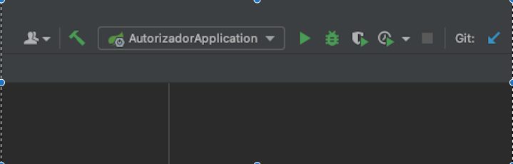
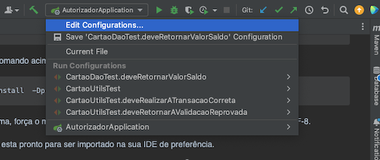
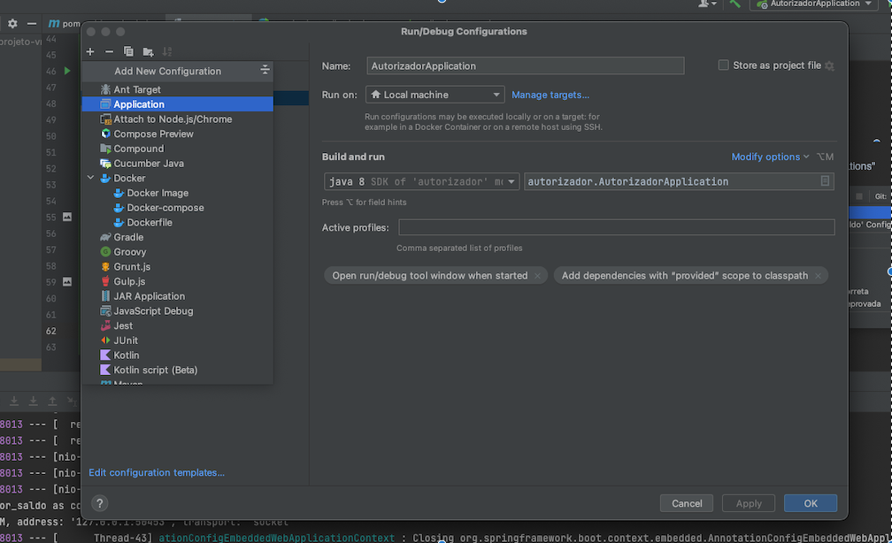
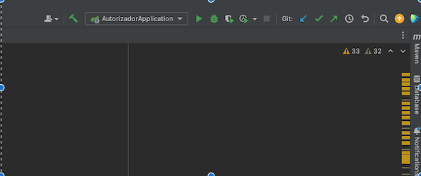

Mini Autorizador - Back

O  Mini Autorizador realiza verificações, análises e transações dos cartões VR(Vale Refeição)

##Documentação

A documentação da API:

Tipo da documentação | Descrição do conteúdo | Link de acesso                                   |
 --- | --- |--------------------------------------------------|
API RESTFull |Endpoints e estrutura das requisições disponiveis na API.| http://localhost:8080//swagger-ui.html
Diagrama de relacionamento | Diagrama de relacionamento das tabelas da API |  |

#Iniciando

Esse passo-a-passo irá permitir que você copie e rode o projeto na sua máquina local para desenvolvimento e teste. Veja a seção de deployment para instruções de como fazer o deploy desse projeto em produção

###Pré-requisitos
Este é um projeto Maven que utiliza o SpringBoot como framework. Logo para conseguir compila-lo é necessário ter o Maven instalado na sua máquina ou utilizar algum plugin Maven na sua IDE de preferência.
Para saber mais sobre como instala o Maven na sua máquina acesse http://maven.apache.org

###Instalando
Pelo terminal acesse a pasta onde se encontra o projeto clonado e insira o seguinte comando:
```
mvn clean install
```
Se ao rodar o comando acima o log reportar erro referente ao enconding, use o comando abaixo:
````
mvn clean install  -Dproject.build.sourceEncoding=CP1252
````
O comando acima, força o maven a utilizar o enconding CP1252 que é a versão Windows do UTF-8.

Agora o projeto esta pronto para ser importado na sua IDE de preferência.

###Rodando o projeto
Escolha a sua IDE preferência. No exemplo foi utilizado o IntelliJ.
Vá na opção de selecionar a configuração para rodar o projeto.

###Instalando
Pelo terminal acesse a pasta onde se encontra o projeto clonado e insira o seguinte comando:
```
mvn clean install
```
Se ao rodar o comando acima o log reportar erro referente ao enconding, use o comando abaixo:
````
mvn clean install  -Dproject.build.sourceEncoding=CP1252
````
O comando acima, força o maven a utilizar o enconding CP1252 que é a versão Windows do UTF-8.

Agora o projeto esta pronto para ser importado na sua IDE de preferência.

###Rodando projeto
Escolha a IDE de sua preferência. o exemplo será no IntelliJ. 



Selecione essa opção e escolha a "Edit Configurations"




Escolha a opoção do "+" e vá em "Apliacations"



Selecione no campo "main class" a classe de inicialização do mini autorizador, a classe
"AutorizadorApplication" e clique em "ok"


Feito isso, clique na opção acima com o símbolo do seta para subir o servidor embutido 
do projeto




